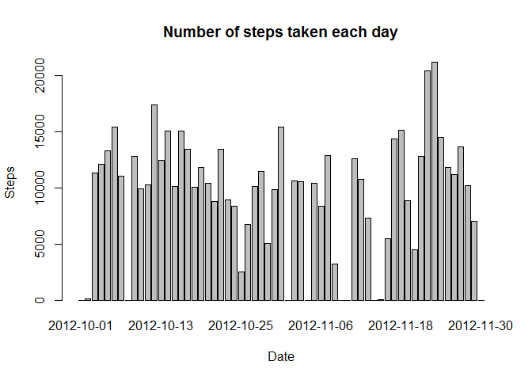
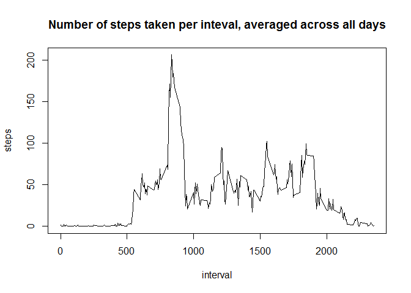
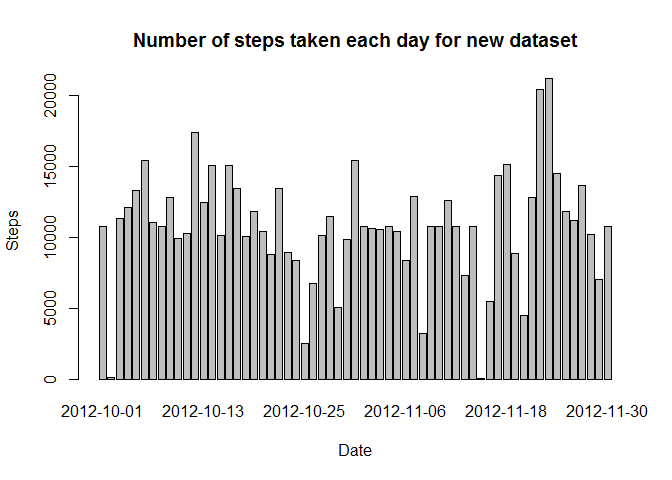
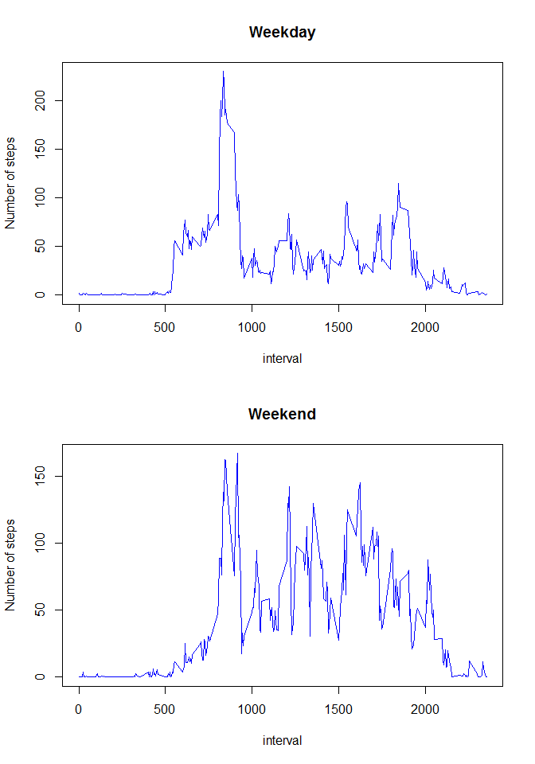

# Reproducible Research: Peer Assessment 1


## Loading and preprocessing the data
_Here I assume that the target zip file is in current working directory._


```r
unzip("repdata_data_activity.zip")
activity <- read.csv("activity.csv")
```
## What is mean total number of steps taken per day?

### Histogram of the total number of steps taken each day

```r
dailysteps <- aggregate(steps ~ date, data=activity, FUN=sum, na.rm = TRUE, na.action = na.pass)
barplot(dailysteps$steps, main="Number of steps taken each day", xlab="Date", ylab="Steps", names.arg=dailysteps$date)
```

<!-- -->

### Mean and median of the total number of steps taken per day
_Days with no values for steps was also included in this calculation as days with zero steps values._

```r
dailymean <- as.integer(mean(dailysteps$steps))
dailymedian <- as.integer(median(dailysteps$steps))
```
The __mean__ of the total number of steps taken per day is __9354__ and the __median__ is __10395__.

## What is the average daily activity pattern?
###Time series plot of the 5-minute interval and the average number of steps taken, averaged across all days

```r
intervalsteps <- aggregate(steps ~ interval, data=activity, FUN=mean, na.rm = TRUE, na.action = na.pass)
plot(intervalsteps, type="l", main="Number of steps taken per inteval, averaged across all days")
```

<!-- -->

###The 5-minute interval that, on average, contains the maximum number of steps

```r
maxinterval <- intervalsteps$interval[which.max(intervalsteps$steps)]
```
The __835__ interval contains the maximum number of steps, averaged across all days.

## Imputing missing values

### The total number of missing values in the dataset 

```r
nanumber <- sum(is.na(activity$steps))
```
The total number of missing values in the dataset is __2304__. 

### Filling in all of the missing values in the dataset with the means for the 5-minute intervals(averaged across all days) 

_Create a new dataset with the missing data filled in_

```r
activitynew <- merge(activity, intervalsteps, by="interval", suffixes=c("", ".avg"))
nadata<-is.na(activitynew$steps)
activitynew$steps[nadata] <- activitynew$steps.avg[nadata]
activitynew$steps.avg = NULL ##delete column
```

### Histogram of the total number of steps taken each day for new dataset 

```r
dailystepsnew <- aggregate(steps ~ date, data=activitynew, FUN=sum)
dailystepsnew$steps<-as.integer(dailystepsnew$steps)
barplot(dailystepsnew$steps, main="Number of steps taken each day for new dataset", xlab="Date", ylab="Steps", names.arg=dailystepsnew$date)
```

<!-- -->

### Mean and median total number of steps taken per day for new dataset

```r
dailymeannew <- as.integer(mean(dailystepsnew$steps))
dailymediannew <- as.integer(median(dailystepsnew$steps))
```
The __mean__ of the total number of steps taken per day for new dataset is __10766__ and the __median__ is __10766__.

These values differ from the estimates of the original data set: __9354__ and the __10395__.

The new values are bigger since the original NA rows are filled with data above zero.

## Are there differences in activity patterns between weekdays and weekends?
Create a new factor variable in the dataset with two levels:weekday and weekend.Since I am in China, I need to add Chinese words for Saturday and Sunday to classify the weekend.


```r
activitynew$daytype <- factor(weekdays(as.Date(activitynew$date)) %in% c( "Saturday","星期六", "Sunday","星期日"), levels=c("FALSE", "TRUE"), labels=c("Weekday", "Weekend"))
```

###Below is the panel plot containing a time series plot of the 5-minute interval (x-axis) and the average number of steps taken, averaged across all weekday days and weekend days (y-axis).

```r
par(mfrow=c(2,1))

##weekday plot
dailystepsweekday <- aggregate(steps ~ interval, data=activitynew, subset=activitynew$daytype=="Weekday", FUN=mean)
plot(dailystepsweekday, type="l", main="Weekday",ylab="Number of steps",col="Blue")

##weekend plot
dailystepsweekend <- aggregate(steps ~ interval, data=activitynew, subset=activitynew$daytype=="Weekend", FUN=mean)
plot(dailystepsweekend, type="l", main="Weekend",ylab="Number of steps",col="Blue")
```

<!-- -->

We can see from the two plots that activity patterns have some differences between weekdays and weekends.
